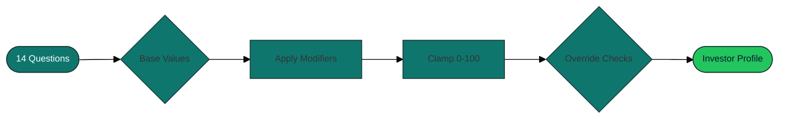

---

layout: cover
class: brand-cover text-white
background: https://source.unsplash.com/collection/94734566/1920x1080

---

# InvestoPilot Risk Assessment

### Translating investor conversations into confident portfolio decisions

  Our structured dialogue captures life stage, financial resilience, and market experience to craft compliant investment journeys.

  
Deterministic

  
Audit-ready

  
Human + Data

  
14 ➜ 6 Dimensions

---

## class: bg-slate-50/60

# Executive Snapshot

  

    
Inputs

    
14

    
questions across life stage, financial health, and experience

  

  

    
Dimensions

    
6

    
risk tolerance, capacity, horizon, experience, regions, exclusions

  

  

    
Time-to-Insight

    
~5 min

    
questionnaire completion to profile preview with guardrails applied

  

  Outcome
  Advisors receive a transparent, documented profile that guides portfolio construction and ongoing suitability checks.

---

## class: brand-light

# Blueprint: From Responses to Profile

  

    

      A deterministic pipeline transforms qualitative narratives and quantitative inputs into a compliant investor blueprint.
    

    <ul class="checklist text-sm">
      <li>Base values seeded by journey-defining questions</li>
      <li>Supportive modifiers calibrate the nuance</li>
      <li>Clamping creates a predictable 0-100 scale</li>
      <li>Overrides enforce fiduciary guardrails</li>
    </ul>
  

  

  

::: info
Risk capacity drops to **0** if the investor lacks an emergency fund, ensuring suitability before sophistication.
:::

---

# What We Measure

  

    
Quantitative Scores (0-100)

    <ul class="dimension-list">
      <li>Risk Tolerance Emotional comfort with volatility</li>
      <li>Risk Capacity Financial ability to absorb risk</li>
      <li>Investment Horizon Time until capital is needed</li>
      <li>Investor Experience Knowledge & decision confidence</li>
    </ul>
  

  

    
Qualitative Preferences

    <ul class="dimension-list">
      <li>Regions Selected Required geographic exposure mix</li>
      <li>Industry Exclusions Ethical and ESG guardrails</li>
      <li>Compliance Notes Overrides triggered by safety checks</li>
    </ul>
  

  Numeric outputs are clamped to the 0-100 range, preserving comparability and easing portfolio mapping.

---

## class: bg-slate-50/50

# Scoring Pipeline

  

    1
    

      
Set Base Values

      
Key life-stage and experience questions seed each dimension.

    

  

  

    2
    

      
Apply Modifiers

      
Supporting responses adjust scores -10 to +40 where relevant.

    

  

  

    3
    

      
Clamp 0-100

      
Strong responses never exceed bounds, maintaining parity across profiles.

    

  

  

    4
    

      
Enforce Overrides

      
Critical red flags (e.g., no emergency fund) instantly cap exposure.

    

  

  
Safety-first override

  
No emergency fund -> Capacity forcibly set to 0 until cash reserves are established.

---

# Question Categories

  

    
🎯

    
Life Stage (3)

    
Journey, timeline, investor profile. Sets the baseline horizon and capacity expectations.

  

  

    
💼

    
Financial Health (5)

    
Income stability, emergency fund, debt, income, net worth. Determines risk capacity headroom.

  

  

    
📚

    
Experience & Preferences (6)

    
Market comfort, investing experience, loss reaction, regions, exclusions. Shapes tolerance and experience.

  

---

## class: brand-light

# Dimension Deep Dive

  

    
Risk Tolerance

    
Additive · Clamp

    <ul class="metric-list">
      <li>Base 0, purely additive</li>
      <li>Q2 comfort: -30 -> +30</li>
      <li>Q3 timeline: -30 -> +30</li>
      <li>Q9 experience: -10 -> +20</li>
      <li>Q11 profile: 0 -> +20</li>
      <li>Q12 loss reaction: -40 -> +30</li>
    </ul>
  

  

    
Risk Capacity

    
Base + Guardrail

    <ul class="metric-list">
      <li>Q1 journey sets 20 -> 70</li>
      <li>Q6 stability: -10 -> +40</li>
      <li>Q7 emergency fund: +10/+20 or hard 0</li>
      <li>Q8 debt: -20 -> +20</li>
      <li>Q13 income: -20 -> +20</li>
      <li>Q14 net worth: -20 -> +20</li>
    </ul>
  

  

    
Investment Horizon

    
Stage + Need

    <ul class="metric-list">
      <li>Q1 journey: 0 / 20 / 70 / 80</li>
      <li>Q3 liquidity need: -50 / -20 / +20</li>
      <li>Q11 profile: -10 / 0 / +10</li>
      <li>Sum clamps to 0-100</li>
    </ul>
  

  

    
Investor Experience

    
Base + Modifier

    <ul class="metric-list">
      <li>Q9 base: 20 / 40 / 70 / 100</li>
      <li>Q10 knowledge adds +0 / +10 / +20</li>
      <li>Clamp keeps confidence grounded</li>
    </ul>
  

---

# Guardrails & Overrides

  

    
We place investor safety above ambition.

    <ul class="checklist text-sm">
      <li>Emergency fund absent -> capacity reset to zero.</li>
      <li>Debt distress signals pull capacity down before it caps tolerance.</li>
      <li>High tolerance cannot overpower capacity or compliance guardrails.</li>
    </ul>
    
Overrides are documented alongside the profile to support audit trails and advisor recommendations.

  

  

    

      
Override Flow

      <ol class="override-list">
        <li>Scan safety-critical responses.</li>
        <li>Trigger caps for mismatched fundamentals.</li>
        <li>Surface advisory actions (e.g., build emergency fund).</li>
      </ol>
    

  

---

## class: bg-slate-50/60

# Preferences & ESG Alignment

  

    
Regions Selected (Q4)

    
Multi-select list ensures 1-5 regions. Codes map directly to InvestoPilot allocation universes.

    <ul class="preference-list">
      <li>NL - Netherlands</li>
      <li>EU_EX_NL - Europe ex-NL</li>
      <li>US - United States</li>
      <li>DEV_EX_US_EU - Other Developed</li>
      <li>EM - Emerging Markets</li>
    </ul>
  

  

    
Industry Exclusions (Q5)

    
"Keep included" interface toggles exposures. Unchecked choices create exclusion tags.

    <ul class="preference-list">
      <li>Tobacco</li>
      <li>Fossil fuels</li>
      <li>Defense industry</li>
      <li>Gambling</li>
      <li>Adult entertainment</li>
      <li>Funds without ESG</li>
    </ul>
    
`NO_ESG_SCREEN` unchecked excludes non-ESG funds from the recommendation engine.

  

---

# Worked Example

  

    
Scenario: Mid-Career Growth Investor

    <ul class="worked-list">
      <li>Q1 Mid-career - Q2 Comfortable with swings</li>
      <li>Q3 Funds needed in 15+ years</li>
      <li>Q4 Regions: US, EM</li>
      <li>Q5 Exclusions: Fossil fuels, Non-ESG</li>
      <li>Q6 Stable income - Q7 Emergency fund ready</li>
      <li>Q8 Manageable debt load</li>
      <li>Q9 Intermediate experience - Q10 Intermediate knowledge</li>
      <li>Q11 Growth focused - Q12 Hold through 20% drawdown</li>
      <li>Q13 $100k-$250k income - Q14 $100k-$500k net worth</li>
    </ul>
  

  

    
Computed Profile

    <ul class="worked-list">
      <li><strong>Risk Tolerance · 70</strong> -> 0 + (0 + 30 + 10 + 20 + 10)</li>
      <li><strong>Risk Capacity · 100</strong> -> 70 + 20 + 20 + 10 + 10 + 0 -> 130 -> clamp</li>
      <li><strong>Investment Horizon · 100</strong> -> 80 + 20 + 10 -> 110 -> clamp</li>
      <li><strong>Investor Experience · 80</strong> -> 70 + 10</li>
      <li><strong>Preferences</strong> -> Regions US + EM - Exclusions Fossil fuels & Non-ESG</li>
    </ul>
  

  Advisor Cue
  Confirm emergency fund status annually; revisit exclusions during suitability reviews.

---

# Design Principles & Use Cases

  

    
What Makes It Robust

    <ul class="principle-list">
      <li>Multi-dimensional view separates emotion from capacity.</li>
      <li>Context-aware life-stage baselines anchor expectations.</li>
      <li>Safety-first overrides document fiduciary care.</li>
      <li>Transparent mappings make audits effortless.</li>
      <li>Bounded scales simplify comparative analytics.</li>
    </ul>
  

  

    
Real-World Applications

    <ul class="principle-list">
      <li>Portfolio allocation calibrated to risk posture.</li>
      <li>Product curation mapped to profile tags.</li>
      <li>Risk monitoring flags misaligned positions early.</li>
      <li>Compliance teams evidence suitability rationale.</li>
      <li>Personalized education tailored to experience gaps.</li>
    </ul>
  

---

layout: center
class: text-center

---

# Implementation Complete ✓

## From questionnaire to documented investor profile

  14 questions -> 6 dimensions -> Personalized investment strategy

  Built with data-driven methodology for InvestoPilot

